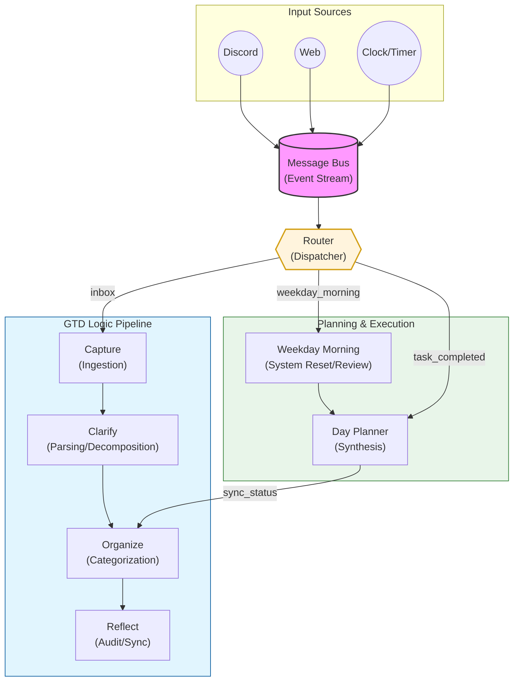

```mermaid
graph TD
    %% Input Layer (The Producers)
    subgraph Inputs [Input Sources]
        Discord((Discord))
        Web((Web))
        Clock((Clock/Timer))
    end

    %% Communication Layer
    MessageBus[("Message Bus<br/>(Event Stream)")]

    %% Decision Layer
    Router{{"Router<br/>(Dispatcher)"}}

    %% The GTD Processing Pipeline (The Workers)
    subgraph GTDPipeline [GTD Logic Pipeline]
        direction TB
        Capture["Capture<br/>(Ingestion)"]
        Clarify["Clarify<br/>(Parsing/Decomposition)"]
        Organize["Organize<br/>(Categorization)"]
        Reflect["Reflect<br/>(Audit/Sync)"]

        Capture --> Clarify
        Clarify --> Organize
        Organize --> Reflect
    end

    %% The Planning Layer (The Macro-Loop)
    subgraph Planning [Planning & Execution]
        DayPlan["Day Planner<br/>(Synthesis)"]
        WeekdayMorning["Weekday Morning<br/>(System Reset/Review)"]
    end

    %% Connections
    Discord --> MessageBus
    Web --> MessageBus
    Clock --> MessageBus

    MessageBus --> Router

    %% Routing Logic: GTD Flow
    Router -- "inbox" --> Capture
    
    %% Routing Logic: Planning Flow
    Router -- "weekday_morning" --> WeekdayMorning
    WeekdayMorning --> DayPlan
    
    %% Routing Logic: Completion & Execution
    Router -- "task_completed" --> DayPlan
    DayPlan -- "sync_status" --> Organize

    %% Styling
    style MessageBus fill:#f9f,stroke:#333,stroke-width:2px
    style Router fill:#fff4dd,stroke:#d4a017,stroke-width:2px
    style GTDPipeline fill:#e1f5fe,stroke:#01579b
    style Planning fill:#e8f5e9,stroke:#2e7d32
```